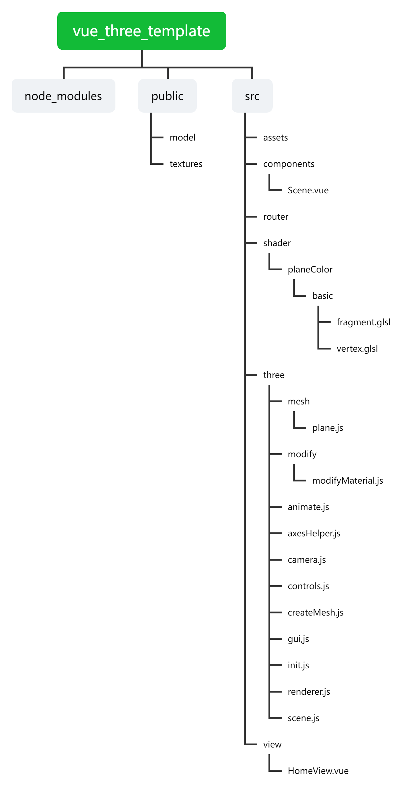

# vue_three_template
# VUE最简Three模板

## Project setup
```
yarn install
```

### Compiles and hot-reloads for development
```
yarn serve
```

### Compiles and minifies for production
```
yarn build
```

### Lints and fixes files
```
yarn lint
```


 **src目录详细介绍** 
1. assets文件夹

用于存放资产资源，如图片、音频、模型等。

2.componets文件夹

用于存放vue组件，目前有scene.vue用于初始化three场景。

3.router文件夹

用于路由设置。

4.shader文件夹

用于存放Three中使用的片元着色器及顶点着色器glsl文件。

5.three文件夹

用于存放Three相关文件。

1）mesh文件夹存放实体相关js文件，例如加载gltf模型、立方体物体等。

2）modify文件夹用于存放修改材质的js文件，可以通过该部分js加载实体的着色器。

3）animate.js--动画帧执行函数

4）axesHelper.js--辅助坐标轴函数

5）camera.js--相机设置函数

6）controls.js--控制器设置函数

7）createMesh.js--创建实体函数

8）gui.js--设置dat.gui函数

9）init.js--初始化屏幕函数

10）renderer.js--渲染器函数

11）scene.js--场景设置函数

6.view文件夹

用于存放vue视图。

7.App.vue 和 main.js

入口视图及主入口函数。
详见：[VUE_Three_Template搭建](https://blog.csdn.net/damadashen/article/details/126064919?spm=1001.2014.3001.5501)